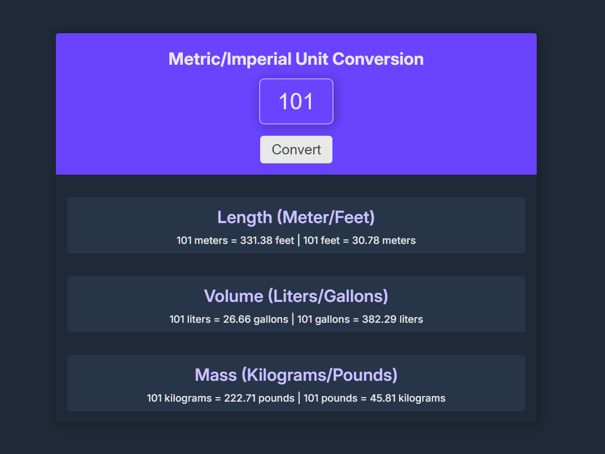

# unit-converter

This is a project courtesy of Scrimba - a practice on JavaScript specifically on the use of `addEventListener`, template literals, and `toFixed` method.

### Goals
- Built from scratch.
- Display following the [Figma design](https://www.figma.com/design/cqtGul0V8RFXY4vTcIv1Kc/Unit-Conversion?node-id=0-1&t=FcVmcPYD38ru0SqA-0).
- Generate all conversions when the user clicks "Convert"
- Round the numbers down to three decimal places

### What I have learned
- With the use of `toFixed()` method, I am able to round off numbers in designated decimal places.

- The use of `template literals` has been helpful to me to set a template string with the `${}` syntax to include the value of the equation inside the string.